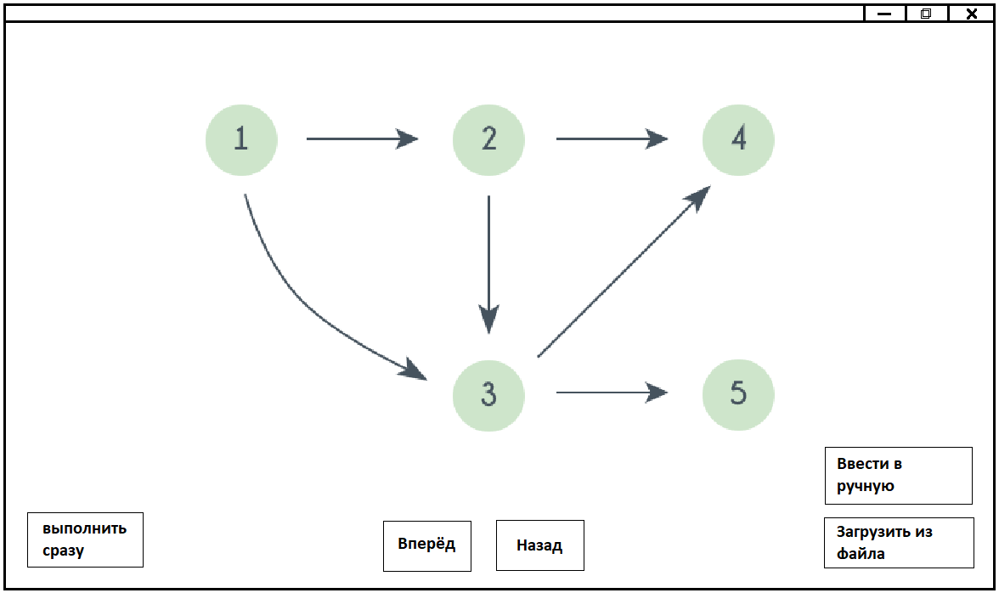

# topological-sorting
Проект представляет собой интерактивную программу, реализующую алгоритм топологической сортировки ориентированного ациклического графа (DAG).

Взаимодействие с программой осуществляется через графический интерфейс, обеспечивая наглядность и удобство изучения алгоритма. Визуальная часть программы будет выполнена с использованием библиотеки [JavaFX](https://openjfx.io/).

## Установка
Предполагается, что на вашем устройстве будут установлены [python3](https://www.python.org/) и [pip3](https://pypi.org/project/pip/).

### Linux/MacOS
Из корня проекта запустите скрипт `setup.sh` (при необходимости выдайте ему права на исполнение):

```sh
chmod 755 setup.sh     # при необходимости и/или возникновении Permission dined
./setup.sh             # сборка программы
```

### Windows
Из корня проекта запустите скрипт `setup.bat`:

```PowerShell
.\setup.bat             # сборка программы
```

## Использование
Вам необходимо запустить программу и дать ей на вход граф. После чего программа его обрабатывает и начинается процесс самой сортировки, которой вы сможете управлять.

### Запуск
Запустить программу вы можете следующим образом: **TODO**
```
TODO
```

### Входные данные
На вход программа требует граф в следующих видах:
- файл с графом: json-подобный файл с расширением `.graph`. Пример такого файла можно увидеть в папке `data`. (*рекомендуемый вариант*)
- ...

#### Рекомендация по построению графа
Граф рекомендуем задавать через сервис [programforyou.ru](https://programforyou.ru/graph-redactor). После того, как закончите задавать граф, нажмите на `Скачать граф` в левом меню и далее `Скачать .graph`. Именно этот файл вы и можете передать нашей программе.


### Результат
Вы можете наблюдать построенный граф, который был передан программе, а также возможность взаимодействия с программой (этапами топологической сортировки, а именно на каждом этапе будет отображаться текущая вершина и обновленный порядок) следующим образом:
- Шаг вперёд
- Шаг назад
- Перейти к результату сортировки
- Загрузить новый граф
- ...



## Важная информация
Команда разработчиков не несёт ответственности за предоставленные вами некорректные входные данные, поэтому прежде чем связываться с разработчиками, проверьте всё ещё раз.

### Распределение ролей
| Задача                   | Исполнители                  |
|--------------------------|------------------------------|
| frontend                 | magicjabka & ~~saicooo~~     |
| backend                  | stepanviolet & bermaxim      |
| build scripts            | stepanviolet                 |
| Управление репозиторием  | stepanviolet                 |

### План разработки
| Дата:    | Этап работы               |
|---------:|---------------------------|
| 27.06 пт | Спецификация              |
| 30.06 пн | План (прототип?)          |
| 02.07 ср | Прототип (1-ая версия?)   |
| 04.07 пт | 1-ая версия               |
| 07.07 пн | 2-ая версия (prod+report?)|
| 08.07 вт | prod+report               |

## Связь с разработчиками
- stepanviolet@gmail.com (рекомендовано)
- [stepanviolet](https://vk.com/stepanviolet)
- magicjabka1337@gmail.com (крутой типо4ек)
- [magicjabka](https://vk.com/emokaaa)

